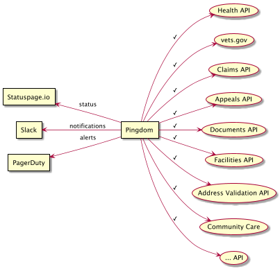

# lighthouse-external-monitoring

Configuration and tooling for automated configuration for monitoring APIs from an external perspective.

#### Requirements
- Monitor APIs from the external client perspective, i.e. from outside the VA network.
- Provide alerts of outages via Slack and PagerDuty, where different APIs report to different
  Slack channels and/or have different PagerDuty escalation paths.
- Provide real time availability status to consumers via Statuspage.

#### Design Goals
- Self service health check model. API teams can add their own checks that are deployed automatically.
- Increased resiliency by reducing the number of components.
- Simplify maintenance with a focused repository that is not co-mingled with unrelated items.
- Broader external perspective. Monitor APIs from outside of the VA and AWS networks.
- Configuration changes must be applied to different environments at different times, e.g.
  monitoring changes may be applied to dev-api.va.gov before they are applied to api.va.gov.

#### Is/Is Not
This repository
- IS responsible for automated configuration of health checks.
- IS NOT responsible for Statuspage, PagerDuty, or Slack configuration,
  e.g. this repository would link check api.va.gov/services/fhir/v0/dstu2/metadata to the
  _on-call-support_ escalation policy in PagerDuty, but not define the escalation policy itself.
- IS NOT responsible for _in VA network_ checks, e.g. DNS look up of internal assets.

#### Check Requirements
A _check_ is a periodic API service call that is validated to determine a service is available.
It mimics external usage.

- Support HTTP and HTTPS protocols.
- Support GET and POST methods.
- Support network connectivity DNS look ups and Ping checks.
- Ability to specify customer HTTP request headers, e.g. client keys.
- Ability to specify query parameters.
- Ability to verify expected status codes.
- Ability to verify response content by string comparison (contains/not contains)
- Ability to include sensitive information via secret management, e.g. client key, in configuration.
- Ability to specify frequency, time for down, alert frequency.
- Ability to specify arbitrary tags on checks to enable searching or grouping.

---

# Pingdom Monitoring

Pingdom will be used to provide all public API availability checks.

Pingdom will be integrated with
- Slack to provide notification to teams,
- PagerDuty to provide alerts to on-call support and provides escalation policies,
- Statuspage to provide real-time updates.

> _Note:_
> This approach replaces Blackbox Exporter, Prometheus, and Statuspage Forwarder currently used.
> Blackbox Exporter and Prometheus will continue to be used for other aspects of monitoring,
> at least for the near future.
> Statuspage Forwarder can be completely decommissioned and it's codebase archived.



### Implementation details
- Pingdom API provides the ability to create/update checks.
- This repository will house Pingdom check configuration,
  per [Pingdom Check API](https://docs.pingdom.com/api/#tag/Checks/paths/~1checks/post).
- This repository will provide the tooling to apply Pingdom configuration changes via Jenkins or
  AWS CodeBuild.
- Secret management and substitution will be provided via AWS Parameter Store


---
# What's in the box?
- `build.sh` defines the checks and is executed as part of the automated build.
  This script also defines integration IDs.
- `bin/pingdom` provides basic ability to interact with the Pingdom API.
- `bin/get-secret` is a utility to extract secrets from AWS Parameter store with the ability
   to try local secrets first.
- `templates/*.json` defines check templates in Pingdom API format.
  These checks are processed to substitute template variables and then uploaded
  to Pingdom to create or update checks.
- `pingdom-checks/*.ping` collection of checks, typically one related group of checks per file.
  These checks will be processed and updated in Pingdom.
- `integration-ids.conf` contains shared Pingdom integration IDs. 
   Integration IDs that are not shared can be placed in the `*.ping` health checks directly.
- `user-ids.conf` contains Pingdom user IDs.
   User IDs that are not shared can be placed in the `*.ping` health checks directly.

### Create a new check or update an existing
Create or update `pingdom-checks/*.ping` file to include a new check definition or change an 
existing check.

> Pro Tip: Create a curl command of the check _first_. Once you done this, translating it
> to Pingdom is fairly straight forward.

Pingdom checks use a _template_ to create the HTTP request. Templates are located in the 
`templates/` directories and referred to by name minus the file extension.
Many checks follow the same pattern, so it is likely a template already exists to meet your needs. 
If not, create a new template in Pingdom API check format.

> Warning: As of March 2020, the Pingdom API incorrectly documents request headers structure.
> Instead of a _map_ of headers, you must create a field named `requestheader<Name>`, e.g.
> ```
> "requestheaderAuthorization":"Authorization:Bearer $authorization_token",
> "requestheaderAccept":"Accept:application/json+fhir",
> ```


Updates to checks are performed by _name_. Name changes are seen as new checks. If you need
to change the name, you will need to delete the previous check manually.

#### Template processing
Templates include variables that are substituted as the checks are processed. For example, 
```
{
  "name": "$name",
  "type": "http",
  "host": "$host",
  ...
```
The check definition must include _all_ variables or it will be rejected.

#### Using `bin/pingdom`
The pingdom utility is automatically included in the path available to your checks.
You can use it manually also. See `bin/pingdom --help`

##### Saving checks
The `save-check` command is used to create or update checks in Pingdom. 
You must specify a template (by name) and template arguments for processing. 
```
pingdom save-check \
  --template awesome-check \
  -a name=production-awesomeness \
  -a host=api.va.gov \
  ...
```
You may _test_ templating with the `process-template` command.
```
$ bin/pingdom process-template --template https-public-200 -a name=awesome -a url=awesome.com
Missing template argument: port
Missing template argument: host
Missing template argument: resolution
Missing template argument: group
Missing template argument: responsetime_threshold
Missing template argument: userids_csv
Missing template argument: integrationids_csv
Missing parameters for template: https-public-200
``` 
> Pro Tip: If a template requires an integration or user argument but you do not need one,
> you may use `$NO_INTEGRATIONS` or `$NO_USERS` to satisfy the template. 


### Running locally

> Note: Since there is only one Pingdom instance, testings changes locally is difficult.
A trial account can be used.

If `secrets.conf` file is present, it will be sourced.
This can be used to define sensitive information that is normally extracted from AWS Parameter Store.
Secrets should be a hash array of parameter name to value.
```
typeset -xA SECRETS
SECRETS[/monitoring/pingdom-token]="1234567890"
SECRETS[/dev/community-care/api-key]="abcdefhij"
...
```
Any secrets not available in `secrets.conf` will extracted from AWS Parameter Store. 
In many cases, this will fail if the AWS CLI is not configured correctly locally or you do not
have permission to access the parameter store.

You can test your local secrets with the `check-local-secrets` utility.


# What's done by hand?
Unfortunately, our robots can't do 100% of activities. At least not yet.
The following activities must be done by a human.
- Secret management
- Creating or modifying integrations with Pingdom, e.g. Slack or Statuspage.io
  _Must be performed by a Pingdom administrator_
- Deleting checks
  _Must be performed by a Pingdom administrator._
- Determining integration and user IDs

## Integrations and Users
Integrations are a Pingdom concept that links Pingdom with other services, e.g. PagerDuty and Slack.
Users are "individuals" that should be notified directly. Note that for Statuspage,
an "individual" can also be a Statuspage component since Statuspage component status can be
manipulated via special emails. 

Each PagerDuty "Service" is manually configured as a distinct integration in Pingdom and as such,
each will have a unique ID. PagerDuty services will be used to alert on-call personnel.

Each Slack channel is manually configured as a distinct integration in Pingdom and will also have
unique IDs. Slack channels are used for situational awareness of the teams at large.

Each Statuspage component will have a unique _Alert Contact_ user entry in Pingdom, which will be
used to drive Statuspage.io updates. Alert contact users require manual configuration in Pingdom.


## Adding secrets
Secrets are added to the `dvp-gov-internal` AWS account by hand. Consult with code
owners regard key name. If you cannot or prefer not to add secrets yourself, the code owners
can do this for you.


## How to determine integration and user IDs
You are able to access the Pingdom Integration ID using its website.

> Note: If you do not have access to Pingdom, open a [support ticket with DevOps](https://github.com/department-of-veterans-affairs/lighthouse-devops-support#lighthouse-devops-support) to request an integration ID.

Prerequisites
- Pingdom access

Steps
- Log in to Pingdom (`my.pingdom.com`), and go to Integrations -> Integrations (Be sure to use the `VA API DEVELOPMENT AND OPERATIONS` organization)
- Click on the integration you want the ID of.
- Look at the URL, it should end with "#integrations=[ID]"
- The [ID] is your desired integration ID
- Update `integration-ids.conf`, `user-ids.conf` or your `*.ping` check as appropriate. Be sure to use a descriptive name 
and please add a comment for future developers.

Alternatively, Pingdom Integration IDs and User IDs may be determined using the `manual-integrations-test` and a 
very gross workaround to Pingdom's lack of dedicated APIs for this purpose.

Prerequisites
- Pingdom access
- Pingdom API Token

Steps
- Manually configure the `manual-integrations-test` check in Pingdom to include just the integration or user you are interested in. 
Edit the `manual-integration-test`.
- After saving the check, pull the configuration locally. The ID will be available in the response.
- Update `integration-ids.conf`, `user-ids.conf` or your `*.ping` check as appropriate. Be sure to use a descriptive name 
and please add a comment for future developers.

  
```
# Integration ID
$ bin/pingdom --token $TOKEN get-check manual-integrations-test | jq  .check.integrationids[0]
123456

# User ID
$ bin/pingdom --token $TOKEN get-check manual-integrations-test | jq  .check.userids[0]
987654
```


